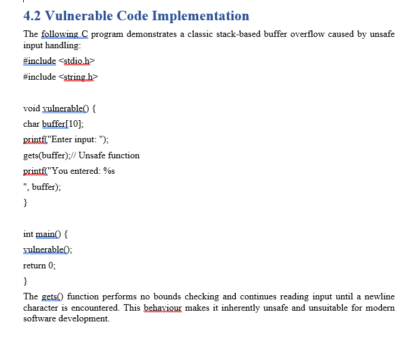
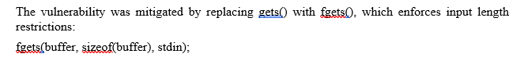
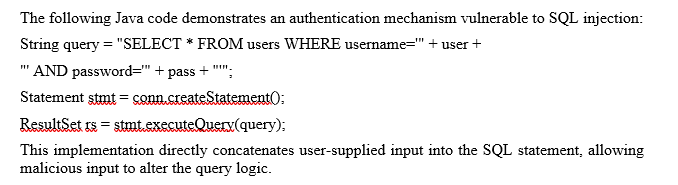
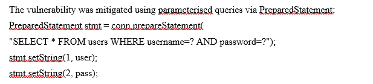
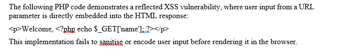
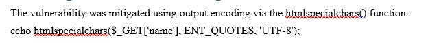
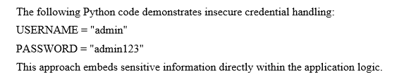
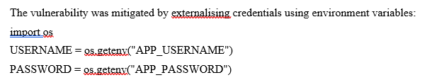
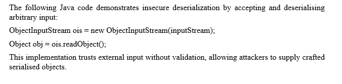
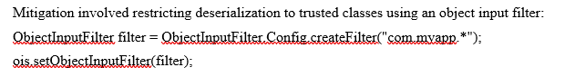

# Secure Coding Assessment Evidence

## Overview

This directory contains selected evidence from the original secure-coding and application-security coursework.

The evidence supports five vulnerability case studies:

1. Buffer Overflow
2. SQL Injection
3. Cross-Site Scripting (XSS)
4. Hardcoded Credentials
5. Insecure Deserialization

Each case study follows the same security-engineering pattern:

```text
Vulnerable Code
      │
      ▼
Security Weakness
      │
      ▼
Controlled Testing
      │
      ▼
Secure Implementation
      │
      ▼
Re-Testing
      │
      ▼
Remediation Validated
```

> The screenshots preserve selected original coursework evidence. Clean, reusable implementations are available separately under `vulnerable-code/` and `secure-code/`.

---

# Evidence Map

| Evidence | Vulnerability | Demonstrates |
| --- | --- | --- |
| `01-buffer-overflow-testing.png` | Buffer Overflow | Unsafe fixed-size buffer and unbounded input |
| `02-buffer-overflow-remediation.png` | Buffer Overflow | Replacement of `gets()` with bounded `fgets()` |
| `03-sql-injection-testing.png` | SQL Injection | Unsafe SQL query construction using string concatenation |
| `04-sql-injection-remediation.png` | SQL Injection | Parameterized query using `PreparedStatement` |
| `05-xss-testing-and-remediation01.png` | XSS | Untrusted PHP input rendered directly into HTML |
| `05-xss-testing-and-remediation02.png` | XSS | Output encoding using `htmlspecialchars()` |
| `06-hardcoded-credentials-vulnerable.png` | Hardcoded Credentials | Authentication secrets embedded in source |
| `07-hardcoded-credentials-remediation.png` | Hardcoded Credentials | Credentials externalized through environment variables |
| `08-insecure-deserialization-vulnerable.png` | Insecure Deserialization | Unrestricted Java object deserialization |
| `09-insecure-deserialization-remediation.png` | Insecure Deserialization | Restricted deserialization using `ObjectInputFilter` |

---

# 01 — Buffer Overflow

## Vulnerable Implementation



The original C implementation allocates:

```c
char buffer[10];
```

and reads user-controlled input using:

```c
gets(buffer);
```

The security problem is that `gets()` does not enforce the capacity of the destination buffer.

Conceptually:

```text
Oversized Input
      │
      ▼
10-Byte Buffer
      │
      ▼
Boundary Exceeded
      │
      ▼
Adjacent Memory May Be Overwritten
```

Potential consequences include:

- Application crashes
- Memory corruption
- Unpredictable execution
- Control-flow corruption in more advanced exploitation scenarios

---

## Secure Implementation



The vulnerable operation is replaced with:

```c
fgets(buffer, sizeof(buffer), stdin);
```

The size of the destination buffer is supplied to the input function.

The remediation changes the behavior to:

```text
Oversized Input
      │
      ▼
Bounded Input Function
      │
      ▼
Buffer Capacity Enforced
      │
      ▼
No Unbounded Write
```

The original coursework reports that oversized input was re-tested after remediation and no crashes or memory corruption were observed.

### Source Code

- [Vulnerable C implementation](../vulnerable-code/buffer-overflow/vulnerable.c)
- [Secure C implementation](../secure-code/buffer-overflow/secure.c)

---

# 02 — SQL Injection

## Vulnerable Implementation



The original Java implementation constructs an SQL statement by concatenating user-controlled values directly into the query.

Conceptually:

```text
SQL Syntax
    +
User Input
    │
    ▼
Single Executable Query
```

This means specially constructed input may influence the intended SQL logic.

Potential consequences include:

- Authentication bypass
- Unauthorized database access
- Data disclosure
- Data manipulation
- Database enumeration

---

## Secure Implementation



The remediation uses:

```java
PreparedStatement
```

with placeholders:

```java
SELECT * FROM users
WHERE username=?
AND password=?
```

Values are then bound separately:

```java
stmt.setString(1, user);
stmt.setString(2, pass);
```

Conceptually:

```text
SQL Structure
      │
      ├──────────────┐
      │              │
      ▼              ▼
Prepared Query    User Data
      │              │
      └──────┬───────┘
             ▼
          Database
```

The application no longer needs to interpret user-controlled values as SQL syntax.

The coursework reports that the original injection attempts were repeated after remediation and authentication bypass was no longer possible.

### Source Code

- [Vulnerable Java implementation](../vulnerable-code/sql-injection/VulnerableLogin.java)
- [Secure Java implementation](../secure-code/sql-injection/SecureLogin.java)

---

# 03 — Cross-Site Scripting

## Vulnerable Implementation



The PHP implementation directly reflects:

```php
$_GET['name']
```

into the HTML response.

The vulnerable pattern is:

```php
<p>Welcome, <?php echo $_GET['name']; ?></p>
```

Conceptually:

```text
Untrusted Input
      │
      ▼
HTML Response
      │
      ▼
Browser
      │
      ▼
Input May Be Interpreted as Code
```

This creates a reflected Cross-Site Scripting condition.

---

## Secure Implementation



The remediation applies:

```php
htmlspecialchars(
    $_GET['name'],
    ENT_QUOTES,
    'UTF-8'
);
```

This encodes characters with special meaning in the HTML context.

The resulting flow becomes:

```text
Untrusted Input
      │
      ▼
Output Encoding
      │
      ▼
HTML-Safe Text
      │
      ▼
Browser
```

The coursework reports that after remediation, the same malicious input was rendered as plain text and JavaScript execution no longer occurred.

### Source Code

- [Vulnerable PHP implementation](../vulnerable-code/xss/vulnerable.php)
- [Secure PHP implementation](../secure-code/xss/secure.php)

---

# 04 — Hardcoded Credentials

## Vulnerable Implementation



The original implementation embeds authentication material directly into Python source code.

The vulnerable pattern is conceptually:

```python
USERNAME = "..."
PASSWORD = "..."
```

The specific historical demonstration values are not important.

The security problem is that:

```text
Application Source
       │
       ├── Program Logic
       │
       └── Authentication Secret
```

are stored together.

Anyone obtaining the source may therefore obtain the credential.

---

## Security Risks

Hardcoded secrets may be exposed through:

- Source repositories
- Developer systems
- Source archives
- Backups
- Reverse engineering
- Accidental repository publication

They also make credential rotation more difficult because changing a secret may require changing application code.

---

## Secure Implementation



The remediation externalizes the values:

```python
import os

USERNAME = os.getenv("APP_USERNAME")
PASSWORD = os.getenv("APP_PASSWORD")
```

The application therefore references runtime configuration rather than embedding credentials directly in its source.

Conceptually:

```text
Application
     │
     ▼
Environment Configuration
     │
     ▼
Credential
```

The coursework reports that source-code review after remediation confirmed that credentials were no longer present in the code.

### Source Code

- [Vulnerable Python implementation](../vulnerable-code/hardcoded-credentials/vulnerable.py)
- [Secure Python implementation](../secure-code/hardcoded-credentials/secure.py)

> The reusable repository examples contain demonstration placeholders only. No real reusable credential is intentionally published.

---

# 05 — Insecure Deserialization

## Vulnerable Implementation



The original Java implementation accepts serialized input and calls:

```java
ObjectInputStream ois =
    new ObjectInputStream(inputStream);

Object obj = ois.readObject();
```

without restricting which object types may be reconstructed.

Conceptually:

```text
Untrusted Serialized Input
          │
          ▼
     ObjectInputStream
          │
          ▼
       readObject()
          │
          ▼
Arbitrary Compatible Object
```

The application therefore places excessive trust in externally supplied serialized data.

---

## Potential Impact

Depending on available classes and dependencies, unsafe native deserialization may contribute to:

- Unexpected object creation
- Application-state manipulation
- Denial of service
- Dangerous gadget-chain execution
- Arbitrary code execution

The exact impact depends on the application's runtime environment.

---

## Secure Implementation



The remediation introduces:

```java
ObjectInputFilter
```

to restrict which classes may be reconstructed.

The original coursework example uses an application-class filter before deserialization.

Conceptually:

```text
Serialized Input
       │
       ▼
Object Filter
    /       \
   /         \
Allowed     Rejected
  │
  ▼
Deserialize
```

This reduces the range of object types available to potentially malicious serialized input.

### Source Code

- [Vulnerable Java implementation](../vulnerable-code/insecure-deserialization/VulnerableDeserializer.java)
- [Secure Java implementation](../secure-code/insecure-deserialization/SecureDeserializer.java)

---

# Vulnerability-to-Control Mapping

| Vulnerability | Root Cause | Primary Secure Coding Control |
| --- | --- | --- |
| Buffer Overflow | Unbounded memory write | Bounded input handling |
| SQL Injection | Code/data mixing | Parameterized queries |
| XSS | Unencoded browser output | Context-aware output encoding |
| Hardcoded Credentials | Secrets embedded in code | External secret configuration |
| Insecure Deserialization | Excessive trust in serialized objects | Restricted/validated deserialization |

---

# Common Pattern

Although the vulnerabilities affect different technologies, they share a recurring design problem:

```text
Untrusted Data
      │
      ▼
Trusted Too Early
      │
      ▼
Unsafe Operation
      │
      ▼
Security Vulnerability
```

The secure implementations introduce a control at that trust boundary.

Examples:

```text
Untrusted Input
      ↓
Length Boundary
```

```text
User Input
      ↓
PreparedStatement
```

```text
Browser Output
      ↓
HTML Encoding
```

```text
Secret
      ↓
External Configuration
```

```text
Serialized Object
      ↓
Object Filter
```

---

# Re-Testing Principle

A major objective of the original coursework was not simply to propose fixes, but to verify them.

The secure-development process used throughout the project is:

```text
Identify Vulnerability
        │
        ▼
Demonstrate Impact
        │
        ▼
Implement Remediation
        │
        ▼
Repeat Original Test
        │
        ▼
Confirm Vulnerability Removed
```

This matters because:

> A code change is not automatically a validated security fix.

---

# OWASP Alignment

The coursework relates the case studies to OWASP security categories.

| Vulnerability | Coursework OWASP Alignment |
| --- | --- |
| Buffer Overflow | A04 — Insecure Design |
| SQL Injection | A03 — Injection |
| Cross-Site Scripting | A03 — Injection |
| Hardcoded Credentials | A07 — Identification and Authentication Failures |
| Insecure Deserialization | A08 — Software and Data Integrity Failures |

These mappings reflect the classification used in the original coursework.

---

# Evidence Integrity

The screenshots in this directory are retained as **original coursework evidence**.

The clean implementations elsewhere in the repository were structured for portfolio readability.

The repository therefore distinguishes between:

### Original Evidence

Screenshots preserved from the academic assessment.

### Vulnerable Examples

Intentionally insecure implementations demonstrating each root cause.

### Secure Examples

Remediated implementations demonstrating safer coding practices.

### Production Recommendations

Additional defensive controls discussed in the documentation but not necessarily implemented in the original exercise.

---

# Scope

The evidence demonstrates educational application-security testing and secure-coding remediation.

It should not be interpreted as evidence of:

- Production application deployment
- Production penetration testing
- Formal source-code audit certification
- Enterprise SDLC implementation
- Production WAF deployment
- Production secret-management infrastructure
- Real-world exploitation of third-party systems

---

# Ethical Use

All vulnerable implementations and security-testing material are provided for:

- Secure-development education
- Application-security learning
- Authorized laboratory testing
- Technical portfolio demonstration

The intentionally vulnerable examples should only be executed in controlled environments.

---

## Related Documentation

- [Secure Coding Methodology](../docs/methodology.md)
- [Buffer Overflow Case Study](../vulnerable-code/buffer-overflow/README.md)
- [SQL Injection Case Study](../vulnerable-code/sql-injection/README.md)
- [XSS Case Study](../vulnerable-code/xss/README.md)
- [Hardcoded Credentials Case Study](../vulnerable-code/hardcoded-credentials/README.md)
- [Insecure Deserialization Case Study](../vulnerable-code/insecure-deserialization/README.md)
